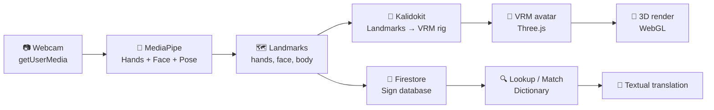
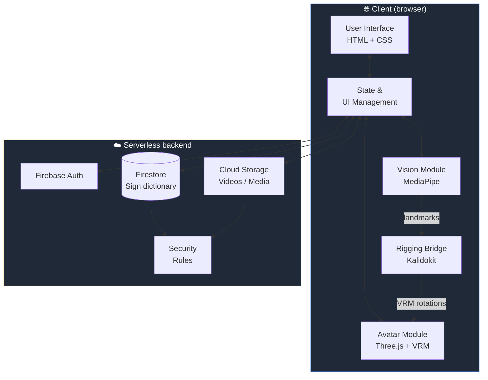
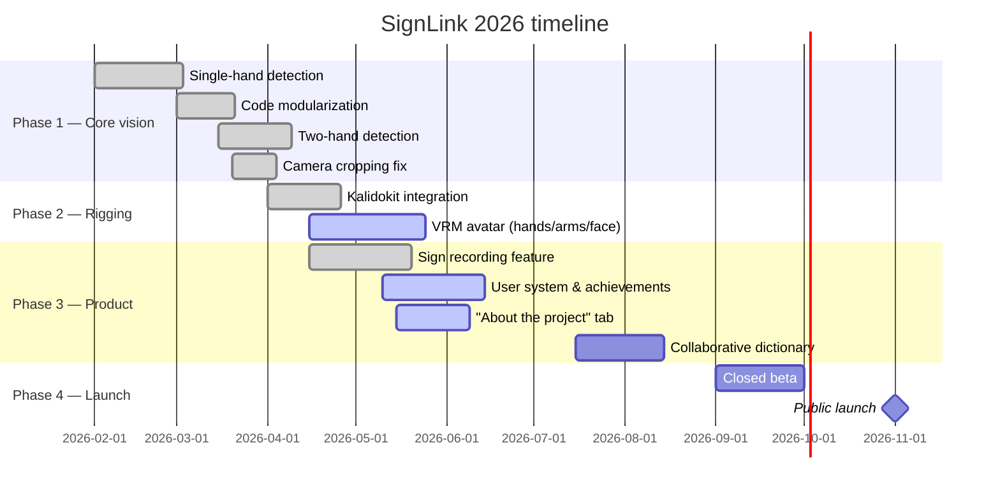

<div align="center">

<a href="./README.ptbr.md">
  
</a>

<br />
<br />


<h3>🤟 A collaborative platform to translate and catalog Brazilian Sign Language (Libras)</h3>

<p>
  <em>Computer vision + 3D VRM avatar + community.</em><br/>
  <em>Accessibility, open source, and social impact — built by students for Brazil and beyond.</em>
</p>

<br />

<!-- Institutional badges -->
<p>
  
  
  
  
  
  
</p>

<!-- Technical badges -->
<p>
  
  
  
  
  
  
  
  
  
  
</p>

<br />

<!-- Showcase row -->
<table>
  <tr>
    <td align="center" width="33%">
      <h3>👁️ Vision</h3>
      <sub>Hand, face & pose tracking<br/>powered by MediaPipe</sub>
    </td>
    <td align="center" width="33%">
      <h3>🧮 Logic</h3>
      <sub>Landmarks → VRM rig<br/>via Kalidokit</sub>
    </td>
    <td align="center" width="33%">
      <h3>🕺 Avatar</h3>
      <sub>Faithful 3D playback<br/>with .vrm in Three.js</sub>
    </td>
  </tr>
</table>

</div>

---

## 📑 Table of Contents

1. [✨ Overview](#-overview)
2. [🎯 Why SignLink?](#-why-signlink)
3. [🚀 Key features](#-key-features)
4. [🧠 How it works — technical pipeline](#-how-it-works--technical-pipeline)
5. [🏗️ Architecture](#️-architecture)
6. [🧰 Tech stack](#-tech-stack)
7. [📐 The math behind the avatar](#-the-math-behind-the-avatar)
8. [🗺️ Roadmap](#️-roadmap)
9. [👥 The team](#-the-team)
10. [🏫 Institution](#-institution)
11. [📜 License](#-license)

---

## ✨ Overview

> **SignLink** is a web platform that translates Brazilian Sign Language (Libras) in real time through the user's webcam, blending **computer vision** (MediaPipe), a **rigging bridge** (Kalidokit), and a **3D VRM avatar** (Three.js). It also works as a **crowdsourced dictionary**, letting anyone contribute by registering new signs — democratizing access to Libras.

<div align="center">

```
 👋  Hand in view  ─►  🧠 MediaPipe  ─►  🔗 Kalidokit  ─►  🕺 VRM avatar  ─►  💬 Translation
```

</div>

---

## 🎯 Why SignLink?

| Problem | How SignLink helps |
| :--- | :--- |
| 🧏 Over **10 million** Brazilians are deaf or hard of hearing. | Real-time visual translation, no human interpreter required for everyday interactions. |
| 📚 Libras learning resources are fragmented and static. | A **collaborative**, indexed and searchable dictionary fueled by the community. |
| 💸 💸 Commercial solutions often require expensive hardware and complex setups. | SignLink is a web-based solution that works on most standard browsers, democratizing access without the need for specialized equipment. |
| 🎓 Few interactive pedagogical tools exist. | A 3D avatar that **replays** registered signs — perfect for visual learners. |

---

## 🚀 Key features

- 🎥 **Real-time webcam capture** via `getUserMedia`, with non-cropped rendering of the camera feed. ✅
- ✋✋ **Two-hand tracking** simultaneously (`maxNumHands: 2`) through MediaPipe Hands. ✅
- 🙂 **Face & head/neck tracking** for expressive avatar mirroring. ✅
- 💪 **Arm and upper-body pose** estimation driving the VRM rig. ✅
- 🔗 **Kalidokit bridge** converts MediaPipe landmarks into VRM-compatible rotations. ✅
- 🕺 **3D VRM avatar** mirroring the user in real time (≈90% of upper-body rig complete). 🟡
- 🔍 **Textual search** across the registered sign dictionary. ✅
- 📹 **Sign recording** through MediaPipe to capture and save new signs from the webcam. ✅
- 👤 **User profiles** with achievements, saved signs, and contribution history. 🟡
- 📖 **"About the project" / history tab** describing motivation, team, and journey. 🟡
- ✅ **Community-driven approval flow** to keep entries high quality. 🟡
- 🔐 **Authentication** via Firebase, with contributor profiles. ✅
- ♿ **Accessibility-first**: WCAG AA contrast, keyboard navigation, ARIA labels. 🟡

> Legend: ✅ done · 🟡 in progress · ⏳ planned

---

## 🧠 How it works — technical pipeline



### 5-stage pipeline

1. **Capture** — webcam frame is drawn to a `<canvas>` preserving aspect ratio (no cropping).
2. **Inference** — MediaPipe returns landmarks for hands (up to 2), face, and upper-body pose.
3. **Normalization** — landmarks are repositioned relative to anchor joints and rescaled.
4. **Kalidokit rigging** — Kalidokit converts MediaPipe landmarks into the rotation/blendshape values a `.vrm` model expects, sidestepping manual quaternion math.
5. **Rig application** — Three.js applies the resulting bone rotations and morph targets to the VRM avatar every frame.

---

## 🏗️ Architecture



### Modularization (design principle)

The client architecture follows strict separation of concerns:

| Module | Responsibility | Why isolated? |
| :--- | :--- | :--- |
| 👁️ **Vision** | Webcam capture + MediaPipe | Can be swapped (e.g., another model) without touching the UI. |
| 🔗 **Rigging** | Kalidokit landmark → VRM conversion | Isolates the math/format bridge from both vision and rendering. |
| 🕺 **Avatar** | Three.js scene, VRM rig, rotations | 3D rendering has its own loop and cost profile. |
| 🎨 **UI** | DOM, events, forms, search | Keeps the interface predictable and testable. |
| 🔌 **State** | Wires the modules via events | Single integration point — avoids coupling. |

---

## 🧰 Tech stack

<div align="center">

### Front-end


### Computer vision


### Rigging bridge


### 3D & animation


### Back-end / infrastructure


### Tooling


</div>

---

## 📐 The math behind the avatar

Driving a humanoid rig from a 2D camera requires turning each landmark cluster into the rotation a bone should have. Instead of hand-rolling quaternions for every joint, SignLink delegates this step to **[Kalidokit](https://github.com/yeemachine/kalidokit)**, which consumes MediaPipe's hand / face / pose landmarks and emits the exact rotation and blendshape data a **VRM** humanoid expects.

At a glance, the conversion still follows the classic recipe per bone:

```
v        = normalize(p_end - p_start)
axis     = cross(v_rest, v)
angle    = acos(dot(v_rest, v))
rotation = quaternionFromAxisAngle(axis, angle)
```

…but Kalidokit handles smoothing, biomechanical constraints, and the VRM-specific axis conventions for us. The output is applied directly to the VRM humanoid bones each frame via Three.js.

> 💡 **Why VRM + Kalidokit?**
> VRM standardizes humanoid rigs across avatars, and Kalidokit gives us a battle-tested mapping from MediaPipe to that rig — letting the team focus on Libras-specific logic instead of reinventing inverse kinematics.

---

## 🗺️ Roadmap



| Milestone | Status | Target |
| :--- | :---: | :--- |
| Single-hand detection | ✅ Done | — |
| Modularization (`vision.js`, `avatar.js`, `ui.js`) | ✅ Done | — |
| Two-hand tracking (`maxNumHands: 2`) | ✅ Done | — |
| Camera cropping fix | ✅ Done | — |
| **Kalidokit integration (MediaPipe → VRM)** | ✅ Done | — |
| **VRM avatar — hands, arms, head/neck/face** | 🟡 ~90% done | May/2026 |
| **Sign recording from webcam** | ✅ Done | — |
| **User system (profile, achievements, saved data)** | 🟡 In progress | Jun/2026 |
| **"About the project" / history tab** | 🟡 In progress | Jul/2026 |
| Collaborative CRUD for signs | ⏳ Planned | Jul/2026 |
| Community approval flow | 🟡 In progress | Aug/2026 |
| Closed beta | ⏳ Planned | Sep/2026 |
| Public launch | 🎯 Goal | Nov/2026 |

---

## 📺 System Demonstration

**Registering sign gesture:**
https://github.com/user-attachments/assets/4c1fd856-28c3-4138-b2d7-25a2ae286131

> 💡 **Note:** The video ends 2 seconds before the full gesture completion to demonstrate the system's noise-filtering logic, preventing the database from saving unwanted hand movements at the end of a recording.

**Acessing sign gesture:**
https://github.com/user-attachments/assets/51cfc5d3-d30b-4772-8be6-494e7816a0c8

---

## 👥 The team

<div align="center">

<table>
  <tr>
    <td align="center" width="25%">
      <br/>
      <strong>Gabriel Feltrin Emilio</strong><br/>
      <sub>🧭 Tech Lead &<br/>Software Architecture</sub>
    </td>
    <td align="center" width="25%">
      <br/>
      <strong>Arthur Leite Ferreira</strong><br/>
      <sub>🛠️ Data &<br/>Back-end Engineer</sub>
    </td>
    <td align="center" width="25%">
      <br/>
      <strong>João Vitor Santos Silva</strong><br/>
      <sub>🛠️ Data &<br/>Back-end Engineer</sub>
    </td>
    <td align="center" width="25%">
      <br/>
      <strong>Gustavo Ferreira Santos</strong><br/>
      <sub>🎨 Front-end &<br/>UX/UI Designer</sub>
    </td>
  </tr>
</table>

</div>

---

## 🏫 Institution

<div align="center">

**Federal Institute of São Paulo — Birigui Campus**

🎓 Computer Engineering | 📍 Birigui, SP — Brazil | 📅 2026

</div>

---

## 📜 License

Released under the **MIT** license. See `LICENSE` for details.

---

<div align="center">

<sub>Built with 🤟 by IFSP students — because accessibility is a right, not a favor.</sub>

<br /><br />

<a href="./README.ptbr.md">
  
</a>

</div>
