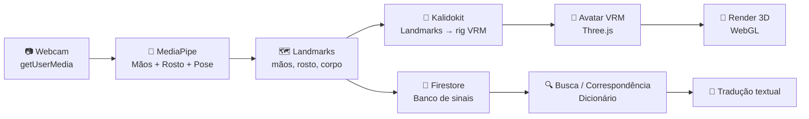
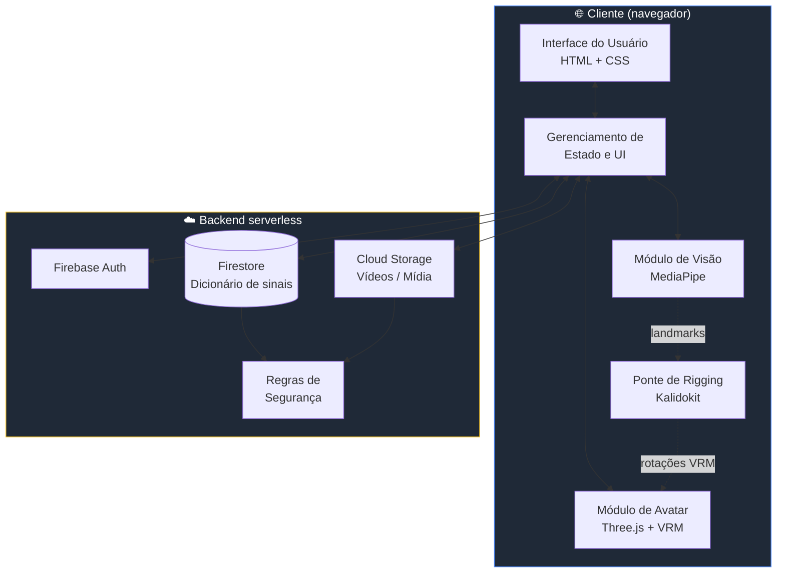
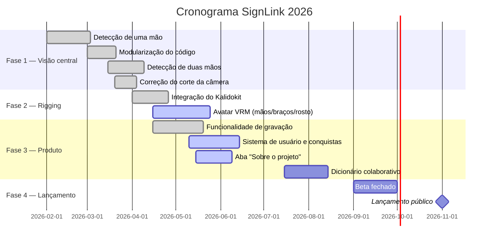

<div align="center">

<a href="./README.md">
  
</a>

<br />
<br />


<h3>🤟 Uma plataforma colaborativa para traduzir e catalogar a Língua Brasileira de Sinais (Libras)</h3>

<p>
  <em>Visão computacional + avatar 3D VRM + comunidade.</em><br/>
  <em>Acessibilidade, código aberto e impacto social — feito por estudantes para o Brasil e o mundo.</em>
</p>

<br />

<!-- Badges institucionais -->
<p>
  
  
  
  
  
  
</p>

<!-- Badges técnicas -->
<p>
  
  
  
  
  
  
  
  
  
  
</p>

<br />

<!-- Linha de destaque -->
<table>
  <tr>
    <td align="center" width="33%">
      <h3>👁️ Visão</h3>
      <sub>Rastreamento de mãos, rosto e pose<br/>com MediaPipe</sub>
    </td>
    <td align="center" width="33%">
      <h3>🧮 Lógica</h3>
      <sub>Landmarks → rig VRM<br/>via Kalidokit</sub>
    </td>
    <td align="center" width="33%">
      <h3>🕺 Avatar</h3>
      <sub>Reprodução 3D fiel<br/>com .vrm no Three.js</sub>
    </td>
  </tr>
</table>

</div>

---

## 📑 Sumário

1. [✨ Visão geral](#-visão-geral)
2. [🎯 Por que o SignLink?](#-por-que-o-signlink)
3. [🚀 Principais funcionalidades](#-principais-funcionalidades)
4. [🧠 Como funciona — pipeline técnico](#-como-funciona--pipeline-técnico)
5. [🏗️ Arquitetura](#️-arquitetura)
6. [🧰 Stack de tecnologias](#-stack-de-tecnologias)
7. [📐 A matemática por trás do avatar](#-a-matemática-por-trás-do-avatar)
8. [🗺️ Roadmap](#️-roadmap)
9. [👥 O time](#-o-time)
10. [🏫 Instituição](#-instituição)
11. [📜 Licença](#-licença)

---

## ✨ Visão geral

> O **SignLink** é uma plataforma web que traduz a Língua Brasileira de Sinais (Libras) em tempo real através da webcam do usuário, combinando **visão computacional** (MediaPipe), uma **ponte de rigging** (Kalidokit) e um **avatar 3D VRM** (Three.js). Também funciona como um **dicionário colaborativo**, permitindo que qualquer pessoa contribua cadastrando novos sinais — democratizando o acesso à Libras.

<div align="center">

```
 👋  Mão em quadro  ─►  🧠 MediaPipe  ─►  🔗 Kalidokit  ─►  🕺 Avatar VRM  ─►  💬 Tradução
```

</div>

---

## 🎯 Por que o SignLink?

| Problema | Como o SignLink ajuda |
| :--- | :--- |
| 🧏 Mais de **10 milhões** de brasileiros são surdos ou têm deficiência auditiva. | Tradução visual em tempo real, sem necessidade de intérprete humano para interações do dia a dia. |
| 📚 Os recursos de aprendizado de Libras são fragmentados e estáticos. | Um dicionário **colaborativo**, indexado e pesquisável, alimentado pela comunidade. |
| 💸 Soluções comerciais frequentemente exigem hardware caro e configurações complexas. | Arquitetura baseada na web: Acessível pela maioria dos navegadores padrão, eliminando a necessidade de equipamentos especializados e democratizando o acesso. |
| 🎓 Existem poucas ferramentas pedagógicas interativas. | Um avatar 3D que **reproduz** os sinais cadastrados — perfeito para quem aprende visualmente. |

---

## 🚀 Principais funcionalidades

- 🎥 **Captura de webcam em tempo real** via `getUserMedia`, com renderização sem corte da imagem da câmera. ✅
- ✋✋ **Rastreamento de duas mãos** simultaneamente (`maxNumHands: 2`) através do MediaPipe Hands. ✅
- 🙂 **Rastreamento de rosto e cabeça/pescoço** para espelhamento expressivo do avatar. ✅
- 💪 **Estimativa de pose** de braços e parte superior do corpo controlando o rig VRM. ✅
- 🔗 **Ponte Kalidokit** que converte landmarks do MediaPipe em rotações compatíveis com VRM. ✅
- 🕺 **Avatar 3D VRM** espelhando o usuário em tempo real (≈90% do rig da parte superior concluído). 🟡
- 🔍 **Busca textual** no dicionário de sinais cadastrados. ✅
- 📹 **Gravação de sinais** através do MediaPipe para capturar e salvar novos sinais a partir da webcam. ✅
- 👤 **Perfis de usuário** com conquistas, sinais salvos e histórico de contribuições. 🟡
- 📖 **Aba "Sobre o projeto" / histórico** descrevendo motivação, time e trajetória. 🟡
- ✅ **Fluxo de aprovação pela comunidade** para manter as entradas com alta qualidade. 🟡
- 🔐 **Autenticação** via Firebase, com perfis de contribuidores. ✅
- ♿ **Acessibilidade em primeiro lugar**: contraste WCAG AA, navegação por teclado, rótulos ARIA. 🟡

> Legenda: ✅ concluído · 🟡 em andamento · ⏳ planejado

---

## 🧠 Como funciona — pipeline técnico



### Pipeline em 5 etapas

1. **Captura** — o quadro da webcam é desenhado em um `<canvas>` preservando a proporção (sem corte).
2. **Inferência** — o MediaPipe retorna landmarks das mãos (até 2), do rosto e da pose da parte superior do corpo.
3. **Normalização** — os landmarks são reposicionados em relação às articulações de referência e reescalados.
4. **Rigging com Kalidokit** — o Kalidokit converte os landmarks do MediaPipe nos valores de rotação/blendshape que um modelo `.vrm` espera, evitando a matemática manual de quatérnios.
5. **Aplicação do rig** — o Three.js aplica as rotações de ossos e os morph targets resultantes ao avatar VRM a cada quadro.

---

## 🏗️ Arquitetura



### Modularização (princípio de design)

A arquitetura do cliente segue uma separação rígida de responsabilidades:

| Módulo | Responsabilidade | Por que é isolado? |
| :--- | :--- | :--- |
| 👁️ **Visão** | Captura de webcam + MediaPipe | Pode ser trocado (ex.: outro modelo) sem mexer na UI. |
| 🔗 **Rigging** | Conversão landmark → VRM do Kalidokit | Isola a ponte de matemática/formato tanto da visão quanto da renderização. |
| 🕺 **Avatar** | Cena Three.js, rig VRM, rotações | A renderização 3D tem seu próprio loop e perfil de custo. |
| 🎨 **UI** | DOM, eventos, formulários, busca | Mantém a interface previsível e testável. |
| 🔌 **Estado** | Conecta os módulos via eventos | Ponto único de integração — evita acoplamento. |

---

## 🧰 Stack de tecnologias

<div align="center">

### Front-end


### Visão computacional


### Ponte de rigging


### 3D & animação


### Back-end / infraestrutura


### Ferramentas


</div>

---

## 📐 A matemática por trás do avatar

Controlar um rig humanoide a partir de uma câmera 2D exige transformar cada conjunto de landmarks na rotação que um osso deve ter. Em vez de calcular manualmente os quatérnios de cada articulação, o SignLink delega essa etapa ao **[Kalidokit](https://github.com/yeemachine/kalidokit)**, que consome os landmarks de mãos / rosto / pose do MediaPipe e emite exatamente os dados de rotação e blendshape que um humanoide **VRM** espera.

Em resumo, a conversão ainda segue a receita clássica por osso:

```
v        = normalize(p_end - p_start)
axis     = cross(v_rest, v)
angle    = acos(dot(v_rest, v))
rotation = quaternionFromAxisAngle(axis, angle)
```

…mas o Kalidokit cuida da suavização, das restrições biomecânicas e das convenções de eixos específicas do VRM para nós. A saída é aplicada diretamente aos ossos do humanoide VRM a cada quadro via Three.js.

> 💡 **Por que VRM + Kalidokit?**
> O VRM padroniza rigs humanoides entre avatares, e o Kalidokit nos dá um mapeamento testado em produção do MediaPipe para esse rig — permitindo que o time foque na lógica específica de Libras em vez de reinventar a cinemática inversa.

---

## 🗺️ Roadmap



| Marco | Status | Meta |
| :--- | :---: | :--- |
| Detecção de uma mão | ✅ Concluído | — |
| Modularização (`vision.js`, `avatar.js`, `ui.js`) | ✅ Concluído | — |
| Rastreamento de duas mãos (`maxNumHands: 2`) | ✅ Concluído | — |
| Correção do corte da câmera | ✅ Concluído | — |
| **Integração do Kalidokit (MediaPipe → VRM)** | ✅ Concluído | — |
| **Avatar VRM — mãos, braços, cabeça/pescoço/rosto** | 🟡 ~90% concluído | Mai/2026 |
| **Gravação de sinais pela webcam** | ✅ Concluído | — |
| **Sistema de usuário (perfil, conquistas, dados salvos)** | 🟡 Em andamento | Jun/2026 |
| **Aba "Sobre o projeto" / histórico** | 🟡 Em andamento | Jul/2026 |
| CRUD colaborativo de sinais | ⏳ Planejado | Jul/2026 |
| Fluxo de aprovação pela comunidade | 🟡 Em andamento | Ago/2026 |
| Beta fechado | ⏳ Planejado | Set/2026 |
| Lançamento público | 🎯 Objetivo | Nov/2026 |

---

## 👥 O time

<div align="center">

<table>
  <tr>
    <td align="center" width="25%">
      <br/>
      <strong>Gabriel Feltrin Emilio</strong><br/>
      <sub>🧭 Tech Lead &<br/>Arquitetura de Software</sub>
    </td>
    <td align="center" width="25%">
      <br/>
      <strong>Arthur Leite Ferreira</strong><br/>
      <sub>🛠️ Engenheiro de<br/>Dados e Back-end</sub>
    </td>
    <td align="center" width="25%">
      <br/>
      <strong>João Vitor Santos Silva</strong><br/>
      <sub>🛠️ Engenheiro de<br/>Dados e Back-end</sub>
    </td>
    <td align="center" width="25%">
      <br/>
      <strong>Gustavo Ferreira Santos</strong><br/>
      <sub>🎨 Front-end &<br/>Designer UX/UI</sub>
    </td>
  </tr>
</table>

</div>

---

## 🏫 Instituição

<div align="center">

**Instituto Federal de São Paulo — Campus Birigui**

🎓 Engenharia de Computação | 📍 Birigui, SP — Brasil | 📅 2026

</div>

---

## 📜 Licença

Distribuído sob a licença **MIT**. Veja `LICENSE` para mais detalhes.

---

<div align="center">

<sub>Feito com 🤟 por estudantes do IFSP — porque acessibilidade é um direito, não um favor.</sub>

<br /><br />

<a href="./README.md">
  
</a>

</div>
